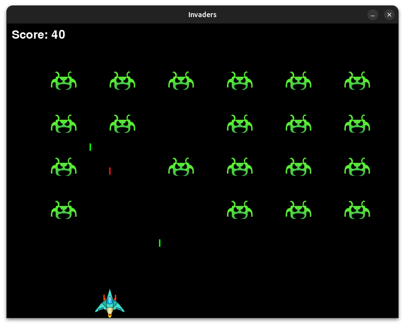

# 👾 Invaders

Este projeto é uma recriação simplificada do clássico jogo **Space Invaders**, desenvolvida em Python usando a biblioteca **pygame**.

## 🎯 Objetivo

O jogador controla uma nave que pode se mover horizontalmente na parte inferior da tela e disparar projéteis para destruir os invasores inimigos. Os invasores descem gradualmente e também atiram no jogador. 

Conforme todos os invasores forem eliminados, um novo conjunto é adicionado na tela com **maior velocidade**, aumentando o nível do desafio. O jogo termina quando a nave do jogador é atingida ou os inimigos alcançam a parte inferior da tela.

## 🧠 Sobre o Projeto

Este jogo foi desenvolvido como parte da disciplina **Python Scripting** do curso de **Pós-graduação em Ciência de Dados e Big Data** da **Pontifícia Universidade Católica do Paraná (PUC-PR)**.

## 🛠️ Tecnologias Utilizadas

- Python 3.11.11
- pygame 2.6.1

## 🗂 Estrutura do Projeto

```
space-invaders/
├── invaders.py           # Ponto de entrada do jogo
├── game.py               # Lógica principal do jogo
├── entities.py           # Classes das entidades (nave, tiros, invasores)
├── ui.py                 # Telas de início e fim de jogo
├── images/               # imagens da nave e dos invasores
├── sounds/               # Efeitos sonoros
└── README.md             # Este arquivo
```

## ▶️ Como Jogar

1. Clone o repositório:
   ```bash
   git clone https://github.com/vargastiago/invaders.git
   cd invaders
   ```

2. Instale as dependências:
   ```bash
   pip install pygame
   ```

3. Execute o jogo:
   ```bash
   python invaders.py
   ```

## 🎮 Controles

- **← / →**: mover a nave
- **Espaço**: atirar
- **Enter**: iniciar o jogo
- **Q**: sair do jogo
- **R**: reiniciar após o game over

## 📸 Capturas de Tela


